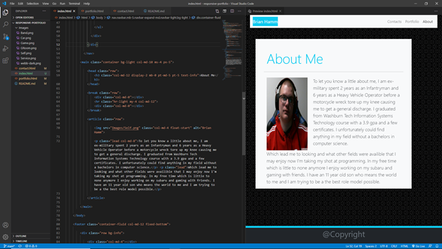

<header>
    <h1>Responsive Portfolio</h1>
</header>

<body>

<h2>Purpose:</h2>
    

 The purpose of this activity was to use bootstrap and only bootstrap code to try an match our portfolio with the ones provided in the example pictures. While doing this we need to make sure all three pages could adapt depending on the amount of screen they were given. Lastly the website must function properly, provide accessibility when possible and provide clean code. 

<h2>Task List:</h2>

<ol>
    <li> Deploy a Functional Webpage </li>
    <li> Provide consistency among the layout of the pages. </li>
    <li> Links provided must be operational. </li>
    <li> Use semantic html and provide clean code. </li>
    <li> Information provide must be personal. </li>
    <li> All items above must use bootstraps code only and correctly. </li>
</ol>

<h2>Website Deployment</h2>

 The current version of this website can be found here. <a href="https://bhamm90.github.io/responsive-portfolio/">(Portfolio)</a>

<h2>Feedback</h2>

 Please get ahold of me with any suggestions for features/items you believe should be added. Also feel free to let me know of any issues you may come across while using the page. You can reach me on <a href="https://stackoverflow.com/users/14324130/bhamm90">Stack Overflow</a> with any comments and concerns. For any issues and fixes you can file an issue at the <a href="https://github.com/BHamm90/responsive-portfolio">Responsive Portfolio Repository</a> so I can fix them as soon as possible. 

<h3>Website Preview:</h3>

<h3>Preview of the HTML: <h3>

 

 

<h4>Looking Forward: </h4>

 Looking forward I would like to continue updating this portfolio with the most current information. Possibly would like to add some projects I've built or been working on. Hopefully, turning personal portfolio into more of a professional one to show my skills learns and achievements in the course.

<Footer>
 
 © 2020 Trilogy Education Services, a 2U, Inc. brand. All Rights Reserved. 

</Footer>